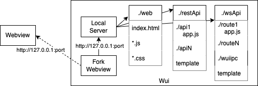

# JS-Wui

JS-Wui (JavaScript Webview user interface) is used to create standalone cross-platform apps for macos, linux and windows. Apps are written using a serverless-model: static web pages, and REST and websocket interfaces. The frontend is [webview](https://github.com/webview/webview) augmented with JS-Wui bindings for:

- [Portable File Dialogs](https://github.com/samhocevar/portable-file-dialogs) for file/directory selection, messages and notifications.
- A Node C++ addon for file read and write.
- A websocket-based IPC allows the webview app to invoke NodeJS functions.
- Invoking modular backend REST functions.

The backend is a NodeJS/Express web server. New backend functions that implement REST and websocket interfaces can easily be added by implementing handler functions that are disovered by the backend when it starts.

A deployed app executable can be created with [pkg](https://www.npmjs.com/package/pkg).

[Architecture](#architecture)

[Wui Interface](#wui)

[Using the example](#using)

[License](#license)

# Architecture <a name="architecture"></a>



A wui app consists of a standard template that:
- Starts a local web server on some unused port.
- Forks a process that launches a Webview aimed at the server's address (http://127.0.0.1:port).

The web app server component directories are specified in ```appConfig.js``` which defaults to:
- ./web: index.html and all referenced JavaScript and CSS files.

- ./restApi: Contains directories that implement each REST API. Each REST interface is a directory which contains handlers for each method available on that intefaces. A handler is called with an object ```{event: headers: http_request_headers, body: http_request_body}```. The example defines the REST api ```apipath``` that implements ```GET```.

- ./wsApi: A websocket is used to implement IPC between the frontend webview and backend handlers. IPC routes, e.g. ```route1```, between the webview and their handlers are multiplexed onto a websocket. This directory contains IPC routes handlers that are named for their route, e.g. ```route1.js``` for ```route1```

# Webview Interface <a name="webview"></a>

The webview interface is exposed by a NodeJS C++ addon.

```
const webview = require('./addon_webview.node')
webview.start({
  title<string'>,
  size: Uint16Array.from([w<Int>, h<Int>]),
  url<String>,
  debug<Boolean>
});
```

```webview.start``` creates and starts a new webview with the specified parameters. See [webview](https://github.com/webview/webview) for details of the ```start``` parameters.

```start``` also causes a ```Wui``` global object to be created in the webview. This object has methods for functions available in browsers but not in the core webview.

# Wui Interface <a name="wui"></a>

## Portable File Dialogs

The following ```Wui``` methods expose [Portable File Dialogs](https://github.com/samhocevar/portable-file-dialogs/tree/main) which provides native file and message dialogs.

```Wui.message(title<String>, msg<String>, msgType<String>)<String>```

Display ```msg``` with ```title``` and icon ```msgType```. Returns the message pressed button. ```msgType``` can be "info", "question" or "warning". The pressed button can be: "yes", "no", "cancel", "ok", "abort", "retry" or "ignore".

```
const button = Wui.message('Message title', 'message text', 'info');
```

```Wui.notify(title<String>, msg<String>, msgType<String>)<String>```

Display ```msg``` with ```title``` and icon ```msgType```. Returns "done". ```msgType``` can be "info", "question" or "warning".

```
const resp = Wui.notify('Message title', 'message text', 'info');
```

```Wui.readFileDialog()<Object>```

Display a dialog for the user to select a file. Returns ```{path: filePath}``` where ```filePath``` is the absolute path to the file.

```
const {path} = Wui.readFileDialog();
```

```Wui.selectFolder()<Object>```

Display a dialog for the user to select a folder. Returns ```{path: folderPath}``` where ```folderPath``` is the absolute path to the folder.

```
const {path} = Wui.selectFolder();
```

```Wui.writeFileDialog(defaultFileName<String>)<Object>```

Display a dialog for the user to select a file to write to; defaults to  ```defaultFileName```. Returns ```{path: filePath}``` where ```filePath``` is the absolute path to the file.

```
const {path} = Wui.readFileDialog('defaultFileName');
```

## Read/Write File

```Wui``` has methods for reading and writing files.

```Wui.readFile(filePath<String>)<Object>```

Read the file ```filePath```. Returns ```{data: fileContents}``` where ```fileContents``` is a string containing the the file's contents.

```
const {data} = Wui.readFile(filePath);
```

```Wui.writeFile(filePath<String>, data<String)<Object>```

Writes ```data``` to the file ```filePath```. Returns "done".

```
const resp = Wui.writeFile(filePath, 'some data');
```

## IPC

These interfaces enable sending and receiving messages over a websocket between webview and backend NodeJS handlers.

### Webview Interface

```Wui.send(route<String>, msg<Object>)```

Sends ```msg``` to the handler for```route```.

```Wui.on(route<String>, cb<Function>)<Boolean>```

Calls ```cb``` with a message argument when a  message on ```route``` is received. Returns ```false``` if the underlying websocket is closed otherwise ```true```.

### Route Handler Interface

```Wui.send(msg<Object>)```

Sends ```msg``` on this handler's IPC.

```Wui.onmessage(cb<Function>)```

Calls ```cb``` with a message argument when a  message is received.

```
// handler route1.js
exports.handler = ws => {
  ws.onmessage(msg => {
    let resp = //do something with msg
    ws.send(resp);
  })
}

// webview
Wui.on('route1', msg => {
  //do something with msg
})

Wui.send('route1', msg);
```

## REST

This interface enables a sender in the webview to invoke a REST API backend NodeJS handler. A backend handler is selected based on the API URL and the request method. The URL is ``` `${window.location.href}api/${apiName}` ```.

```fetch``` example:

```
let resp = await fetch(`${window.location.href}api/doSomething`); // GET
resp = await fetch(
  `${window.location.href}api/doSomething`,
  {method: 'POST'}
); // POST
```

In the above case there are two different handlers for ```doSomething``` GET and POST.

```XMLHttpRequest``` example:

```
const http = new XMLHttpRequest();
http.open('POST', `${window.location.href}api/doSomething`);
http.send();
```

# Using <a name="using"></a>

Install the repo.

```
git clone git@github.com:boblund/JS-Wui.git
cd JS-Wui
```

Then, build the webview add-on. Node-gyp needs to be installed for this.

```
cd webview
npm install
cp build/Release/addon_webview.node ../wui-app/
```

Then, install and run the example wuiApp.

```
cd ../wui-app
npm install
node wuiApp.js
```

An executable version of the wuiApp.js can be made with [pkg](https://www.npmjs.com/package/pkg). The ```package.json``` property ```name``` in the wui-app directory will be your executable name. The ```targets``` property will be the executable versions built. Then run:

```
pkg .
```

This will leave executable files in the ```dist``` directory.

# License <a name="license"></a>

Creative Commons Attribution-NonCommercial 4.0 International

THIS SOFTWARE COMES WITHOUT ANY WARRANTY, TO THE EXTENT PERMITTED BY APPLICABLE LAW.
