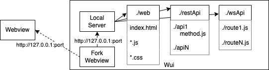

# JS-Wui

JS-Wui (JavaScript Webview user interface) is used to create standalone cross-platform apps for macos, linux and windows. Apps are written as web apps using HTML, CSS, JavaScript and Nodejs. The user interface is displayed using [webview](https://github.com/webview/webview). Webview JavaScript bindings expose [Portable File Dialogs](https://github.com/samhocevar/portable-file-dialogs) for file/directory selection, messages and notifications. A Node C++ addon provides JavaScript bindings for file read and write. A websocket-based IPC allows the webview app to invoke NodeJS functions. A deployed app executable can be created with [pkg](https://www.npmjs.com/package/pkg).

[Architecture](#architecture)

[Wui Interface](#wui)

[Developing an app](#using)

[Building wui-app ](#building)

[Extending wui-app](#extending)

[License](#license)

# Architecture <a name="architecture"></a>



A wui app consists of a standard template that:
- Starts a local web server on some unused port.
- Forks a process that launches a Webview aimed at the server's address (http://127.0.0.1:port).

The server web app component directories are specified in ```appConfig.js``` which defaults to:
- ./web: index.html and all referenced JavaScript and CSS files.
- ./restApi: An API template and directories that implement each REST API. The implementation uses the Amazon Web Services (AWS) serverless application ([SAM](https://aws.amazon.com/serverless/sam/)) model. The template defines information about each API. Each API directory includes an ```app.js``` file that is the entry point for the API logic.
- ./wsApu: same as ./restApi except for websockets.

The SAM serverless lambda model provides a flexible, modular way to implement APIs. In SAM, lambdas have no persistant data and run in independent contexts. In a wui app, the lambdas are loaded via ```require``` into the same process and can use any nodejs data store or sharing method, e.g. ```global```.

# Webview Interface <a name="webview"></a>

The webview interface is exposed by a NodeJS C++ addon.

```
const webview = require('./addon_webview.node')
webview.start({
	title<string'>,
	size: Uint16Array.from([w<Int>, h<Int>]),
	url<String>,
	debug<Boolean>
});
```

```webview.start``` creates and starts a new webview with the specified parameters. See [webview](https://github.com/webview/webview) for details of the ```start``` parameters.

```start``` also causes a ```Wui``` global object to be created in the webview. This object has methods for functions available in browsers but not in the core webview.

# JS-Wui Interface <a name="wui"></a>

## Portable File Dialogs

The following ```Wui``` methods expose [Portable File Dialogs](https://github.com/samhocevar/portable-file-dialogs/tree/main) which provides native file and message dialogs.

```Wui.message(title<String>, msg<String>, msgType<String>)<String>```

Display ```msg``` with ```title``` and icon ```msgType```. Returns the message pressed button. ```msgType``` can be "info", "question" or "warning". The pressed button can be: "yes", "no", "cancel", "ok", "abort", "retry" or "ignore".

```
const button = Wui.message('Message title', 'message text', 'info');
```

```Wui.notify(title<String>, msg<String>, msgType<String>)<String>```

Display ```msg``` with ```title``` and icon ```msgType```. Returns "done". ```msgType``` can be "info", "question" or "warning".

```
const resp = Wui.notify('Message title', 'message text', 'info');
```

```Wui.readFileDialog()<Object>```

Display a dialog for the user to select a file. Returns ```{path: filePath}``` where ```filePath``` is the absolute path to the file.

```
const {path} = Wui.readFileDialog();
```

```Wui.selectFolder()<Object>```

Display a dialog for the user to select a folder. Returns ```{path: folderPath}``` where ```folderPath``` is the absolute path to the folder.

```
const {path} = Wui.selectFolder();
```

```Wui.writeFileDialog(defaultFileName<String>)<Object>```

Display a dialog for the user to select a file to write to; defaults to  ```defaultFileName```. Returns ```{path: filePath}``` where ```filePath``` is the absolute path to the file.

```
const {path} = Wui.readFileDialog('defaultFileName');
```

## Read/Write File

```Wui``` has methods for reading and writing files.

```Wui.readFile(filePath<String>)<Object>```

Read the file ```filePath```. Returns ```{data: fileContents}``` where ```fileContents``` is a string containing the the file's contents.

```
const {data} = Wui.readFile(filePath);
```

```Wui.writeFile(filePath<String>, data<String)<Object>```

Writes ```data``` to the file ```filePath```. Returns "done".

```
const resp = Wui.writeFile(filePath, 'some data');
```

## IPC

This interface enables a sender in the webview to send a message over a websocket to a backend NodeJS handler. 

```Wui.send(route<String>, msg<Object> [, callback<Function>])<Promise>```

Messages with a given ```route``` are sent to the backend handler for that route ([REF]). If ```callback``` is omitted, returns a Promise otherwise returns ```null```.

Each ```msg``` is sent with a unique ID to the backend handler. This ID must be included in the response from the backend and is used to invoke the corresponding ```callback``` or resolve the ```Promise```. The ```callback``` is called with arguemnts ```error``` (either ```true``` or ```false```) and ```resp``` which is an ```Object```. The Promise is resolved or rejected with a ```resp```.

Wui defines the route ```wuiipc``` handler [REF]. Handlers for other routes can be defined.

```
const resp = await Wui.send('wuiipc, aJSObject);
.
.
.
Wui.send('wuiipc', (err, msg) => {
	//Do something
})
```

## REST

This interface enables a sender in the webview to invoke a REST API backend NodeJS handler. A backend handler is selected based on the API URL and the request method. The URL is ```${window.location.href}api/${apiName}```.

```fetch``` example:

```
let resp = await fetch(`${window.location.href}api/doSomething`); // GET
resp = await fetch(
	`${window.location.href}api/doSomething`,
	{method: 'POST'}
); // POST
```

In the above case there are two different handlers for ```doSomething``` GET and POST.

```XMLHttpRequest``` example:

```
const http = new XMLHttpRequest();
http.open('POST', `${window.location.href}api/doSomething`);
http.send();
```

# Developing an app <a name="using"></a>

Install the repo.

```
git clone git@github.com:boblund/JS-Wui.git
cd JS-Wui
npm install
```

A JS-wui app is essentially a web site consisting of static web pages, REST interfaces and a Websocket interface. An app is organized as follows:
```
JS-Wui/
|--- webview/    								
|--- wui-app/
|    |--- web/
|    |--- restApi/
|         |--- apidir/
|         |--- template.yaml
|    |--- wsApi/
|         |--- apidir/
|         |--- template.yaml
|    |--- appConfig.js
```

- webview/ contains the webview C++ addon, that does not need to be changed.
- wui-app/appConfig.js defines where the webpages, and REST and Websocket Interfaces are located.
- wui-app/web, restAPI, wsAPI contain the directories for web pages, REST interfaces and the Websocket interface for the sample app.

The entry point for the app must be named ```index.html```. The names and structure of the other components are up to the app developer.

The optional REST and Websocket interfaces use the Amazon Web Services (AWS) serverless application ([SAM](https://aws.amazon.com/serverless/sam/)) model which defines information about each interface.

The REST and Webscoket intefaces are described in ```template.yaml``` that defines the set of interface handlers:
		- ```CodeUri``` is the relative path to access handler
		- ```Handler``` is the handler function file name minus the extenstion'.

Each interface handler is in a sub-directory ```CodeUri```. The subdirectory contains the hander logic ```app.js``` that exports a function, e.g. ```app.lambdaHandler```.

# Example <a name="example"></a>

The ```wui-app``` directory contains an example of a JS-Wui app.

# Building a JS-Wui app <a name="building"></a>

# License <a name="license"></a>

Creative Commons Attribution-NonCommercial 4.0 International

THIS SOFTWARE COMES WITHOUT ANY WARRANTY, TO THE EXTENT PERMITTED BY APPLICABLE LAW.
